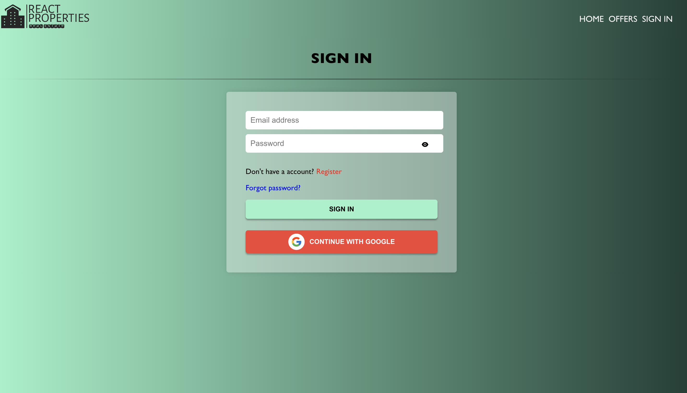
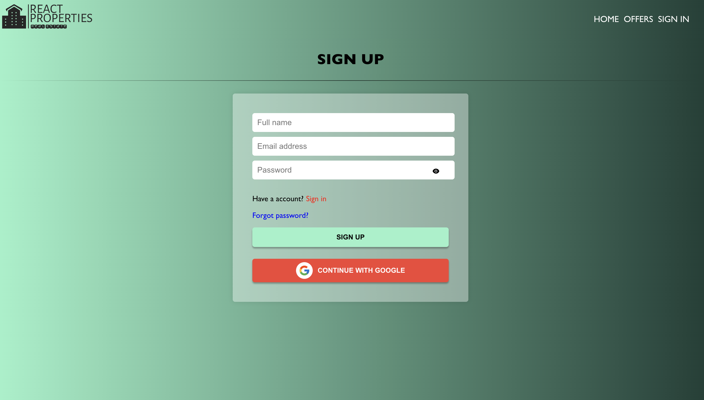
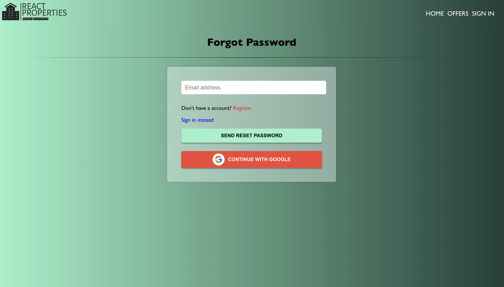

# Project Overview

> React Properties is a small-sized web application that enables users to view and contact owners for properties available for rent or sale. The application is built using the React JavaScript library for the frontend, and Firebase for data storage and management.

# Installation

### To install React-Properties, follow these steps:

-   Clone the GitHub repository or download the source code.
-   Navigate to the root directory of the application in your terminal.
-   Run "npm install" to install the dependencies.
-   Run "npm start" to start the development server.

# Project Architecture

> The architecture of the project follows a standard approach commonly used in React-based web applications. The project's root directory is the "src" directory, which contains several sub-directories, including:

## Components:

> This directory contains reusable UI components that can be used across different pages of the application. Each component is located in its own sub-folder, and has its own .module.css file that contains the component's styles.

## Pages:

> This directory contains the different pages of the application, each located in its own sub-folder. Each page component uses the reusable UI components from the "Components" folder and has its own .module.css file that contains the page's styles.

## Hooks:

> This directory contains custom hooks that can be used across different components of the application.

-   ### AuthStatus custom hook

    The AuthStatus custom hook is a React hook that checks the
    authentication status of a user and returns whether they are logged
    in or not, along with a checking status. This hook is designed to be
    used with Firebase's authentication service, using the getAuth and
    onAuthStateChanged methods.

```
import React from "react";
import { AuthStatus } from "./AuthStatus";

const MyComponent = () => {
    const { loggedIn, checkingStatus } = AuthStatus();

    if (checkingStatus) {
        return <div>Checking authentication status...</div>;
    }

    if (loggedIn) {
        return <div>User is logged in.</div>;
    } else {
        return <div>User is not logged in.</div>;
    }
};

export default MyComponent;

```

> In this example, the AuthStatus hook is imported and called within the MyComponent component. The loggedIn and checkingStatus properties of the returned object are then used to display a message indicating the user's authentication status. If the checkingStatus property is true, a message is displayed indicating that the authentication status is being checked. If the loggedIn property is true, a message is displayed indicating that the user is logged in. Otherwise, a message is displayed indicating that the user is not logged in.

## Assets:

This directory contains the static assets such as images, fonts, and other resources used in the application.

# Dependencies:

-   @testing-library/jest-dom: This is a library used for testing React components.
-   @testing-library/react: This is another library used for testing React components.
-   @testing-library/user-event: This library provides simulation of user events in React components.
-   firebase: This package provides access to the Firebase backend.
-   leaflet: This is a library used for creating interactive maps.
-   react: This is the core library used for building React components.
-   react-dom: This is the DOM-specific package for React, allowing React to be used in a web browser.
-   react-geocode: This package allows for geocoding and reverse geocoding of addresses.
-   react-icons: This is a library of icons that can be used in React components.
-   react-leaflet: This package provides a React wrapper around the Leaflet library.
-   react-loading: This package provides a component for displaying loading spinners.
-   react-moment: This package provides a component for formatting dates and times.
-   react-router: This is a library used for handling client-side routing in React applications.
-   react-router-dom: This is a library that provides a set of higher-order components for routing in React applications.
-   react-scripts: This package provides scripts and configuration used by Create React App.
-   react-toastify: This package provides a component for displaying toast messages.
-   swiper: This package provides a touch-enabled slider component for React.
-   uuid: This package provides functions for generating UUIDs.
-   web-vitals: This package provides tools for measuring the performance of web pages.

# Public and private part

## Home (public)


-   This is a React component that fetches and displays listings from a Firebase Firestore database. It uses different queries to fetch recent listings, places for rent, and places for sale separately, and displays them in separate sections on the page. It also includes a slider component at the top of the page. The component uses the useState and useEffect hooks to manage state and fetch data asynchronously. It also uses the Link component from React Router to create links to other pages.

## Offers (public)


-   Offers component fetches a list of offers from a Firebase Firestore database, and displays them using the Offer component. It also uses react-toastify to display error messages.
-   The component uses the useEffect hook to fetch the initial set of offers when it mounts, and the useState hook to manage the state of the listings, loading status, and the last fetched listing. It renders a list of Offer components and a "Load More" button that fetches additional offers when clicked.

## Log In (public)



-   This is a React component for a sign-in form that authenticates users using Firebase's Authentication API.
-   The component has two states: showPassword (a boolean used to show/hide the password field) and formData (an object used to store the user's email and password entered in the form).
-   The component includes two links. The first link, labeled "Register," redirects the user to the registration page when clicked. This is accomplished using the react-router-dom package's Link component, which creates a hyperlink to a specified path in the application.
    

-   The second link, labeled "Forgot password?," redirects the user to the password reset page when clicked. This is also implemented using the Link component.
    

-   The page also includes a "Continue with Google" button implemented using the OAuth component, which allows users to sign in with their Google account.
    

## Navigation (public)


The public navigation is rendered when the user is not authenticated. It displays the following links:

-   HOME: navigates to the home page
-   OFFERS: navigates to the offers page
-   SIGN IN: navigates to the sign-in page

## Navigation (private)


The private navigation is rendered when the user is authenticated. It displays the following links:

-   HOME: navigates to the home page
-   OFFERS: navigates to the offers page
-   LIKES: navigates to the user's likes page
-   PROFILE: navigates to the user's profile page

If the user is not authenticated, the LIKES and PROFILE links are not displayed.

The pathMatch function is used to determine if the current route matches a given path and apply a CSS class to the corresponding navigation link. The CSS styles for the component are imported from a separate CSS module file.

## Listing (public)


The public part of the listing is everything that is displayed on the page regardless of whether the user is logged in or not. This includes the following components:

-   Swiper component: It displays the listing images in a slide show format.
-   Listing details such as price, address, bedrooms, bathrooms, parking, and furnishing.
-   Map component: It displays a map with a marker at the listing location.

## Listing (private)

### Non-owner


### Owner


The private part of the listing is the LikeButton and Contact components, which are only visible to logged-in users.

-   LikeButton component: It allows the logged-in user to like the listing.
-   Contact component: It allows the logged-in user to contact the owner of the listing. This component is only visible if the logged-in user is not the owner of the listing.

## Likes (private only)


-   The MyLikes component displays a list of properties that the authenticated user has liked.

## Profile (private only)


-   "Profile" React component that displays the user's profile information and their listings, and allows the user to edit their profile details, add new listings, and delete existing listings. It uses Firebase authentication and Firestore database to fetch and update data, and React Router to navigate between different pages.
-   The component renders a form with input fields for the user's name and email, and a button to sign out. It also renders a button to add a new listing and a list of the user's existing listings. The component uses the Offer component to display each listing and provides functionality to delete.

### Profile Functionality

-   ADD PROPERTY TO YOUR LISTINGS Button: This button allows the user to add a new listing to their existing listings. Clicking on this button redirects the user to the Create Listing page.

    

-   Edit Button: This button allows the user to edit their name in the form. Clicking on this button changes the state of changeDetails to true, enabling the name field to be editable. Clicking on this button again changes the state back to false, disabling the name field, and updating the user's name in Firebase authentication and Firestore if any changes have been made.

    

-   Apply Changes Button: This button is only visible when the user has clicked on the Edit button and made some changes to their name. Clicking on this button updates the user's name in Firebase authentication and Firestore with the new name that the user has provided.

    

    

-   Sign out Button: Clicking on this button signs the user out of their account and redirects them to the home page.

    

### Edit and Delete


-   Edit Button: This button appears next to each listing and allows the user to edit the listing. Clicking on this button redirects the user to the Edit Listing page.

    

-   Delete Button: This button appears next to each listing and allows the user to delete the listing. Clicking on this button prompts the user with a confirmation message, and if the user confirms, the listing is deleted from Firestore.

    

# Deployment

### The React-Properties app has been deployed on Vercel. To access the deployed version, follow the steps below:

-   Open a web browser and navigate to https://react-properties.vercel.app/.
-   The React-Properties app should load in your browser. You can now interact with the app as you would with the local version.

> Note that the deployed version of the app may have different features or behavior compared to the local version, depending on the deployment settings and environment. If you encounter any issues or errors with the deployed version, please contact georgiddechev@gmail.com for assistance.

# Conclusion

In this documentation, you can find a detailed overview of the React-Properties app, including its features, dependencies, deployment process and installation. I hope that this documentation has been helpful in understanding the app and how it can be used.

> If you have any questions or feedback about the app or this documentation, please feel free to contact me at georgiddechev@gmail.com. Any suggestions or ideas for improving the app or the documentation are welcome.
